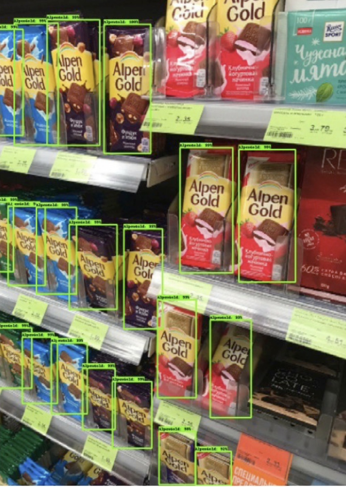
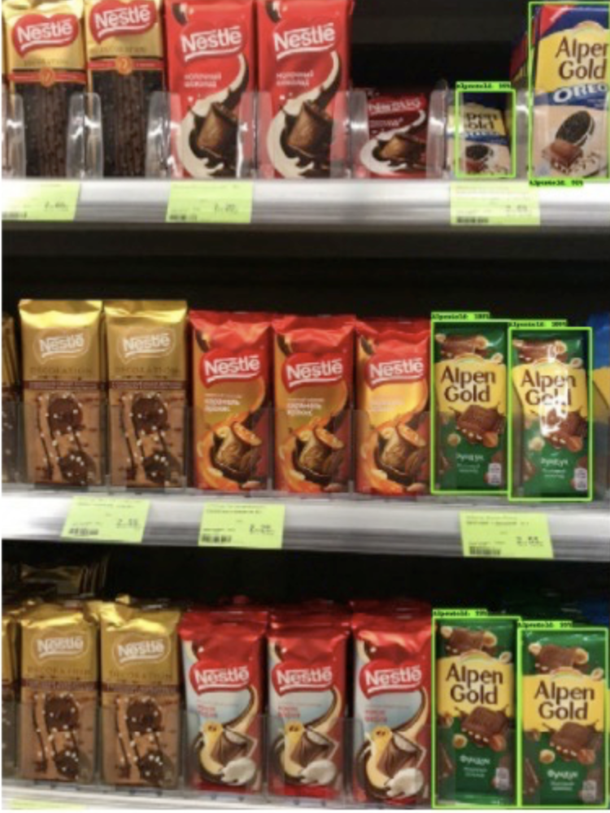

# MLDL Course Labs

This repository contains all the work I managed to accomplish during the Machine Learning / Deep Learning course in 2019.

___
### Lab 1.

The first task was a classification problem that had to be solved with the kNN algorithm on the MNIST Fashion dataset. It had to be built in tensorflow and executed in graph mode. The full solution can be found in [`./lab_1`](https://github.com/ivanklimuk/mldl_rfikt_master_2/blob/master/lab_1/Lab1_mnist_fashion_knn.ipynb).

### Lab 2 - ...

The second task was the first part of a bigger problem: object detection for brand recognition.

- **Dataset**

The objects that I've been trying to detect were the **Alpen Gold** choco bars.

To train the detection model I made ~200 photos of shelves with different kinds of chocolate bars in various grocery stores in Minsk. After that I manually labeled the bounding boxes of the desired objects using [LabelMe](https://github.com/wkentaro/labelme). The images and their annotations can be found [here](https://drive.google.com/drive/folders/1nZRoNVYz3svrYwFDouooG08ARWpEFA7k?usp=sharing).

- **Data processing**

In order to use the convenient [tensorflow object detection API](https://github.com/tensorflow/models/tree/master/research/object_detection) the data had to be converted into the appropriate format - [tfrecords](https://www.tensorflow.org/tutorials/load_data/tfrecord).

For this the raw data and the annotations had to be first converted to either csv or coco format and then to the tfrecords format.

- **Model**

The model that has been trained for detection was a pretrained [Faster RCNN Inception V2](https://github.com/tensorflow/models/blob/master/research/object_detection/g3doc/detection_model_zoo.md). It was trained on ~140 images, tested and then validated on ~30 images each. The complete training configuration with the optimizer, learning rate schedule, augmentation options and other parameters settings. can be found [here](https://github.com/ivanklimuk/mldl_rfikt_master_2/blob/master/choco/model/train_coco.config).

After 95k training steps the model achieved *mean Average Precision* of 0.8 on test the test images (with IoU=0.75). Here are some examples of the detected choco bars:





### Usage

In order to reproduce the results or to run the scripts with a different dataset you can use the following commands

1. Convert the raw images and annotations to coco format (assumes that the data is stored in the same way as in this repo):
```
$ make coco
```

2. Convert the coco formatted data to a set of sharded tfrecords files:
```
$ make tf_records_coco
```

3. Train the model from the predefined config using the tfrecords from step 2:
```
$ make train
```

The training process can be visualized using tensorboard:
```
$ tensorboard --logdir=./choco
```

CSV formatted data usage is WIP.
